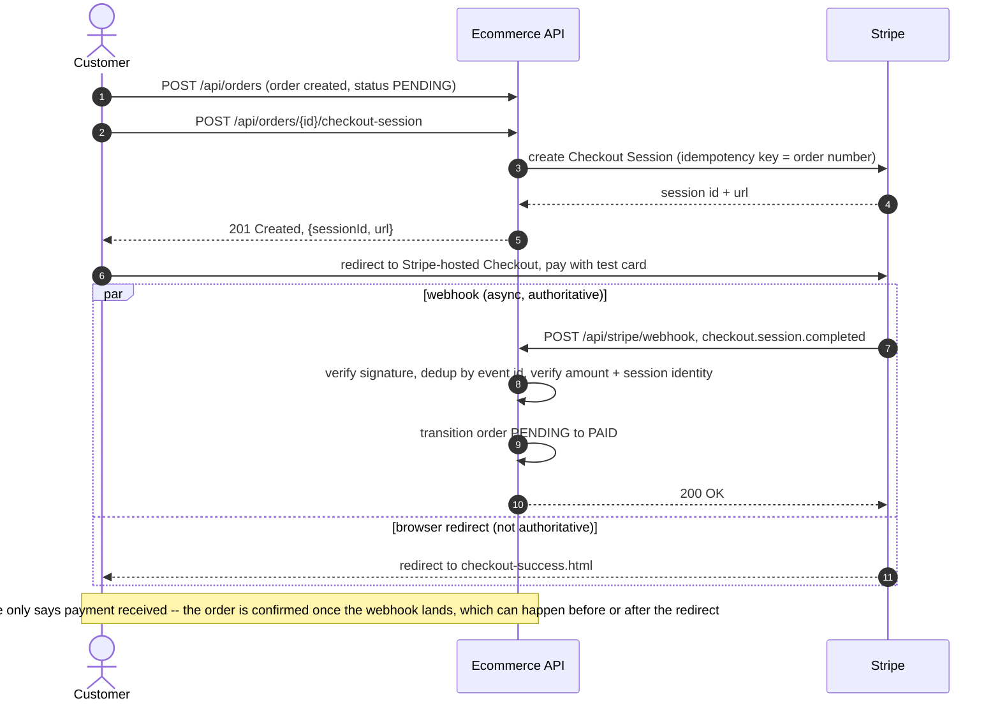
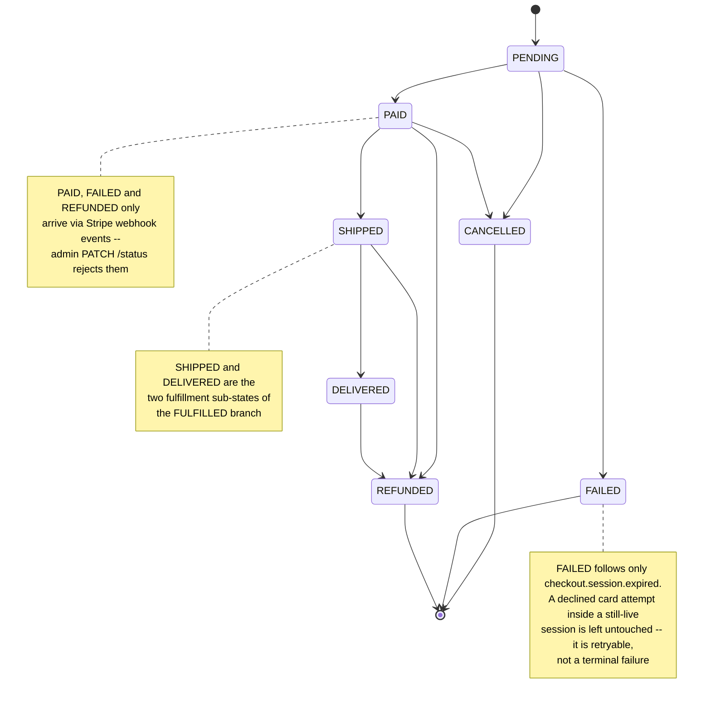

# Ecommerce API

[](https://github.com/Antheagao/ecommerce-api/actions/workflows/ci.yml)

A layered REST API for an ecommerce platform — JWT auth, role-based access, catalog, cart, orders, and Stripe-backed payments — built with Spring Boot 4 and PostgreSQL. Checkout, signed/idempotent webhooks, and admin refunds are fully wired; see [Payments (Stripe)](#payments-stripe). Deployment and a live demo are the last milestone; see [Roadmap](#roadmap).

---

## Quick Start

Requires Docker and Docker Compose.

```bash
cp .env.example .env
docker compose up --build
```

That's it. The app comes up on `http://localhost:8080` once Postgres passes its healthcheck.

- API base: `http://localhost:8080/api`
- Swagger UI: `http://localhost:8080/swagger-ui.html`
- Health: `http://localhost:8080/actuator/health`

**Without Docker:** `.\mvnw.cmd spring-boot:run` works too, but you'll need a local Postgres instance and matching `DB_URL`/`DB_USERNAME`/`DB_PASSWORD`, plus `JWT_SECRET` in the environment (there is deliberately no default — the app refuses to boot without a real secret). See the comments in `.env.example` for pointing a local run at the compose Postgres instead.

### Environment variables (`.env.example`)

| Variable | Default | Notes |
|---|---|---|
| `POSTGRES_DB` | `ecommerce` | Database name |
| `POSTGRES_USER` | `postgres` | Database user |
| `POSTGRES_PASSWORD` | `postgres` | Database password |
| `POSTGRES_HOST_PORT` | `5435` | Host-side port mapping; container always listens on 5432 internally |
| `APP_HOST_PORT` | `8080` | Host-side port for the app container |
| `DB_URL` | `jdbc:postgresql://db:5432/${POSTGRES_DB}` | Composed automatically by `docker-compose.yml` for the `app` service |
| `DB_USERNAME` | — | Set from `POSTGRES_USER` by compose |
| `DB_PASSWORD` | — | Set from `POSTGRES_PASSWORD` by compose |
| `JWT_SECRET` | — | **Required**, minimum 256 bits. No default — compose fails fast rather than booting insecurely |
| `JWT_EXPIRATION_MS` | `86400000` | Token lifetime in ms (24h) |
| `STRIPE_SECRET_KEY` | *(blank)* | Stripe secret key, test mode only (`sk_test_...`). Optional — blank means payment endpoints return `503` |
| `STRIPE_WEBHOOK_SECRET` | *(blank)* | Signing secret for `/api/stripe/webhook` (`whsec_...`), printed by `stripe listen` or set on the Dashboard endpoint |
| `STRIPE_SUCCESS_URL` | *(blank)* | Redirect target after a completed Checkout Session, e.g. `http://localhost:8080/checkout-success.html` |
| `STRIPE_CANCEL_URL` | *(blank)* | Redirect target when the customer cancels Checkout, e.g. `http://localhost:8080/checkout-cancel.html` |

`docker-compose.yml` uses `${VAR:?message}` guards on every required variable — if `.env` is missing or incomplete, `docker compose up` fails immediately with a clear error instead of starting with blank credentials. The four Stripe variables are deliberately *not* guarded (`${VAR:-}`) — the app boots fine with none of them set; the checkout, webhook, and refund endpoints just return `503` until real test-mode values are provided. See [Payments (Stripe)](#payments-stripe) for local setup.

---

## Payments (Stripe)

Checkout runs through Stripe Checkout Sessions (test mode); fulfillment is driven entirely by verified, deduplicated Stripe webhook events, never by the browser redirect.

### Checkout sequence



The webhook can arrive before the customer's browser even finishes redirecting, or seconds after they're already looking at the success page — the two paths race, and only the webhook is trusted to move money-relevant state.

### Order state machine



`PATCH /api/orders/{id}/status` is admin-only and rejects `PAID`/`FAILED`/`REFUNDED` with a 400 — those three only happen through `transitionSystem`, the no-ownership-check path used by the webhook handler and the refund endpoint.

### Why it's built this way

- **Idempotency via a stored event ledger.** Every Stripe event id is inserted into `processed_stripe_events` *before* any business logic runs; a replayed event id hits the table's primary key constraint instead of re-running fulfillment. The entity forces `persist()` over `merge()` (`Persistable.isNew()` hardcoded to `true`) — Spring Data would otherwise route a duplicate-id save through `merge()`, which silently `UPDATE`s the existing row instead of throwing, quietly breaking the whole mechanism.
- **The signature is the authentication.** `/api/stripe/webhook` is `permitAll()` in `SecurityConfig` — there's no JWT, because Stripe calls it server-to-server. `Webhook.Signature.verifyHeader` runs against the raw request body *before* the payload is parsed, so a bad signature is the only thing that returns a 400; a validly-signed but unparseable payload is logged and answered `200` (Stripe retries on any non-2xx, and retrying can't fix a payload it will never be able to parse).
- **Amount and session identity are checked before PAID.** The handler recomputes the order's total in minor units and compares it to `session.amount_total`, and checks the completed session's id against `order.stripeSessionId` — not just `metadata.orderId`. A Checkout Session lives 24h; if a customer re-checks-out and gets a new session, a superseded-but-still-live session completing late can't pay an order that has already moved on.
- **Partial refunds don't transition the order.** `charge.refunded` fires on partial refunds too (a goodwill credit, say); only a charge that's refunded in full moves the order to `REFUNDED`.
- **Admin refunds reconcile through the same webhook path.** `POST /api/admin/orders/{id}/refund` calls Stripe and transitions the order to `REFUNDED` in one transaction — but if that transaction fails after the Stripe call already succeeded, the state isn't silently lost: the later `charge.refunded` webhook resolves the order independently (by matching `paymentReference`, the stored PaymentIntent id) and applies the same transition. Both paths tolerate hitting an order that's already `REFUNDED`.
- **Money is `BigDecimal`, converted to Stripe's minor units exactly.** Every conversion uses `unitPrice.movePointRight(2).longValueExact()` — never `doubleValue()` — so a price that can't convert to whole cents throws instead of silently truncating.

### Testing payments locally

1. Create a free Stripe account and switch to **test mode** at [dashboard.stripe.com](https://dashboard.stripe.com) — grab the test **Secret key** (`sk_test_...`) from Developers → API keys.
2. Install the [Stripe CLI](https://stripe.com/docs/stripe-cli) and run `stripe login`.
3. Forward webhooks to your local app: `stripe listen --forward-to localhost:8080/api/stripe/webhook`. Copy the `whsec_...` it prints.
4. Copy `.env.example` to `.env`, uncomment the `# --- Stripe ---` block, and fill in `STRIPE_SECRET_KEY` and `STRIPE_WEBHOOK_SECRET` with the real values above (leave `STRIPE_SUCCESS_URL`/`STRIPE_CANCEL_URL` pointed at the local `checkout-*.html` pages).
5. `docker compose up --build` (or restart if it's already running).
6. Create an order, `POST` its `checkout-session`, open the returned `url`, and pay with the test card `4242 4242 4242 4242` (any future expiry, any CVC, any postal code).
7. Watch the `stripe listen` terminal fire `checkout.session.completed` and the app logs process it — the order flips `PENDING` → `PAID` there, not on the redirect.

Without any Stripe env set, the app still boots fine — `checkout-session` and `refund` just return `503`, matching `.env.example`'s commented-out block. Keys are test-mode only and are never committed.

---

## Current State

- **Auth** — JWT-based, stateless; `USER` and `ADMIN` roles.
- **7 resource areas** — auth, users, addresses, cart, categories, products, orders — plus Stripe-backed payments (checkout, webhooks, refunds).
- **Layered architecture** — controllers → services → repositories, with DTOs at the API boundary.
- **Payments** — Stripe Checkout Sessions, a signature-verified and idempotent webhook, admin refunds, and a 7-state order state machine driven by payment events. See [Payments (Stripe)](#payments-stripe).
- **Order numbers** — generated via a DB-backed sequence table with pessimistic locking, safe across multiple app instances.
- **Pagination** — supported on catalog and order list endpoints.
- **Database migrations** — Flyway (`db/migration`), `ddl-auto=validate` — schema changes are explicit, versioned SQL, not Hibernate-inferred DDL.
- **Tests** — 258 tests across service, controller, and full-stack layers, including a webhook failure-mode suite (duplicate delivery, webhook-before-redirect, amount/session-identity mismatches, signature failures, partial-then-full refunds) run against a real Postgres via Testcontainers. JaCoCo line coverage: service 94.2%, controller 95.5%, overall 88.6%; the three Stripe classes (`StripeCheckoutService`, `StripeWebhookService`, `StripeWebhookController`) are individually at 100% line coverage.
- **CI** — GitHub Actions runs the full `mvn verify` (build, tests, Testcontainers, JaCoCo) on every push and PR (badge above).
- **Docker** — multi-stage build, non-root runtime user, container healthcheck on `/actuator/health`.

---

## Tech Stack

| Layer | Technology |
|---|---|
| Runtime | Java 21 |
| Framework | Spring Boot 4.0.2 |
| Security | Spring Security 7, JWT (jjwt 0.12.6), BCrypt |
| Data | Spring Data JPA / Hibernate, PostgreSQL 16 (H2 for tests) |
| Migrations | Flyway (`db/migration`, `ddl-auto=validate`) |
| Payments | Stripe Java SDK 33.2.0 — Checkout Sessions, webhooks, refunds |
| API Docs | springdoc-openapi 2.8.6 (Swagger UI) |
| Coverage | JaCoCo 0.8.13 |
| Build | Maven (wrapper — `.\mvnw.cmd`) |
| Test | JUnit 5, Spring Boot Test, MockMvc, Testcontainers (Postgres) |

---

## API Overview

| Resource | Endpoints | Auth |
|---|---|---|
| Auth | `POST /api/auth/register`, `POST /api/auth/login` | Public |
| Users | `GET /api/users/me` | Authenticated |
| Addresses | Full CRUD (`GET`/`POST`/`PUT`/`DELETE /api/addresses[/{id}]`) | Authenticated, user-scoped |
| Cart | `GET /api/cart`, `POST /api/cart/items`, `PATCH /api/cart/items/{id}`, `DELETE /api/cart/items/{id}`, `DELETE /api/cart` (clear) | Authenticated, user-scoped |
| Categories | `GET /api/categories[/{id}]` public; `POST`/`PUT`/`DELETE` | ADMIN for writes |
| Products | `GET /api/products[/{id}]` public; `POST`/`PUT`/`DELETE` | ADMIN for writes |
| Orders | `GET /api/orders`, `GET /api/orders/{id}`, `POST /api/orders` | Authenticated, user-scoped |
| Orders | `POST /api/orders/{id}/checkout-session` | Authenticated, user-scoped (order owner only) |
| Orders | `PATCH /api/orders/{id}/status` | ADMIN — rejects `PAID`/`FAILED`/`REFUNDED` with 400; those only happen via Stripe webhook events |
| Payments | `POST /api/stripe/webhook` | Public — no JWT; `Stripe-Signature` HMAC verification over the raw body is the authentication |
| Payments | `POST /api/admin/orders/{id}/refund` | ADMIN |
| Docs | `/swagger-ui.html`, `/v3/api-docs` | Public |
| Ops | `/actuator/health` | Public |
| Ops | Remaining actuator endpoints | ADMIN |

Send `Authorization: Bearer <token>` for any non-public endpoint.

---

## Project Structure

```
src/main/java/com/antheagao/ecommerce_api/
├── config/          # Security, OpenAPI, PasswordEncoder
├── controller/      # REST controllers
├── dto/             # Request/response DTOs
├── entity/          # JPA entities (User, Product, Category, Order, Cart, etc.)
├── exception/       # Custom exceptions, GlobalExceptionHandler, ErrorResponse
├── repository/      # Spring Data JPA repositories
├── security/        # JwtUtil, JwtAuthFilter, CustomUserDetailsService, CurrentUser
└── service/         # Business logic
```

---

## Running Tests

```bash
.\mvnw.cmd test
```

Most tests run against H2 in-memory with `src/test/resources/application.properties`; `MigrationSmokeTest` and the Stripe webhook replay test (`StripeWebhookPostgresReplayTest`) spin up a real Postgres via Testcontainers instead, since H2 doesn't reproduce Postgres's Flyway migration path or its `23505` unique-constraint semantics that the replay/idempotency behavior depends on. JaCoCo produces a coverage report under `target/site/jacoco` on `mvn verify`.

---

## Roadmap

Stripe Checkout, idempotent/signature-verified webhooks, the payment-driven order state machine, and admin refunds are done — 258 tests green in CI, including a dedicated webhook failure-mode suite (see [Payments (Stripe)](#payments-stripe)).

What's left:

- **Deploy** (Fly.io/Railway/Render) with Docker, a seeded demo account, and Stripe test keys so a recruiter can complete a real end-to-end checkout.
- **Structured logging** on the payment path, and `/actuator/health` wired into the deploy target's health checks.
- **Architecture diagram** in this README once the deploy target is chosen.

---

## License

This project is for portfolio and educational use.
